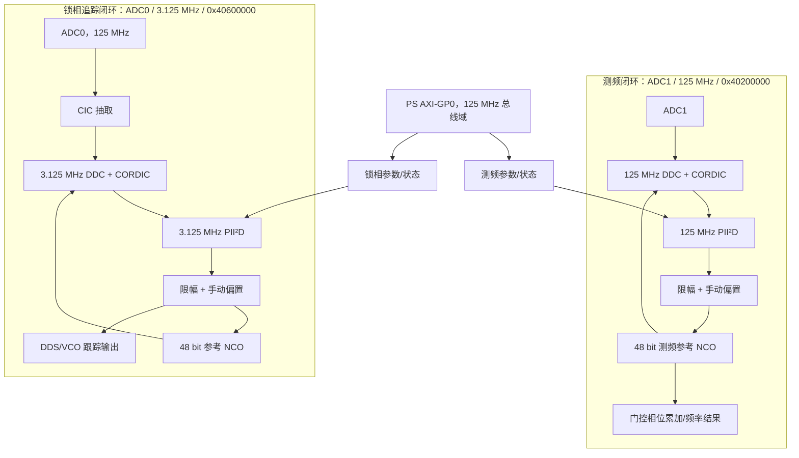
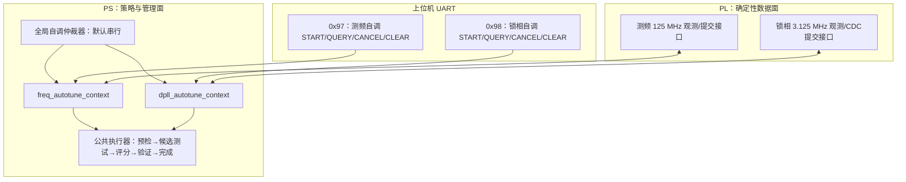

# DPLL 自适应系数调整与 PS 端执行策略

> 文档状态：方案评审稿 v0.3  
> 项目：DPLL_Rewrite_InstrumentBox20260820  
> 目标平台：Red Pitaya / Zynq-7000（xc7z010clg400-1）  
> 当前工程版本：Vivado 2018.3  
> 本文档仅描述方案，不包含代码修改。

## 1. 结论摘要

本项目需要在两条彼此独立的闭环上实现自适应参数调整：

1. **测频回路（FM loop）**：ADC1 输入，DDC、PII²D 环路、限幅和测量累加运行在完整的 125 MHz `clk1` 域，PS 基地址为 `0x40200000`。
2. **锁相追踪输出回路（DPLL loop）**：ADC0 输入，DDC 和 PII²D 核心环路运行在 3.125 MHz `clk_dpll` 域，配置/读回总线运行在 125 MHz，PS 基地址为 `0x40600000`。

两条回路均已允许 PS 读取幅值、瞬时频差、相位残差、环路输出和限幅/锁定状态，也均允许 PS 通过 AXI-GP0 写入 P、I、I²、D 和 D 支路滤波系数，因此都具备自适应升级基础。

但是，不建议直接在当前硬件接口上实现“锁定期间连续调参”。现有各系数独立写入，每次写入都会产生 `gain_changed`，环路滤波器收到该信号后会清空内部状态；该更新脉冲还跨越 125 MHz 与 3.125 MHz 时钟域且没有握手，可能被漏采。四个系数不能原子更新，读取的监测量也没有窗口快照机制。直接增加 PS 轮询代码，可能造成输出跳变、偶发失锁和难以复现实验结果。

需求确定为“上位机发命令、PS 执行异步自适应任务、UART 查询状态”的控制方式。测频回路和锁相回路各使用一条独立命令和一份独立状态；任务完成后由 PS 置位完成标志。最终同时支持三种触发策略：仅上位机命令触发、开机执行一次、开机执行一次并在失锁等事件后自动重调。

推荐采用“先方案 B 验证，再方案 C 工程化”的两阶段路线：

- 方案 B：只修改 PS，采用受控解锁、逐个写入、重新锁定的方式，对候选参数档进行试验和评分。该阶段首先通过上位机命令触发，验证观测指标、状态机、参数范围和完成状态协议。
- 方案 C：PL 负责可靠观测与安全执行，PS 负责统计、状态判断和参数决策。加入统计快照、影子参数、原子提交/确认及参数渐变后，再启用开机自调和失锁自动重调。

完整方案遵循：

1. 为测频回路和锁相回路建立两个独立的 `autotune_context`，参数、状态、完成标志、失败原因和最近稳定档互不覆盖。
2. PL 增加低资源统计快照、影子参数、原子提交/确认、参数渐变和事件计数；两路使用相同的寄存器偏移定义，但位于各自基地址。
3. PS 以 10～20 Hz 执行状态机，根据幅值、幅值波动、频差、相位残差、限幅率和失锁事件选择离散参数档位。
4. 第一版只自适应 `Kp`、`Ki`，`Kii` 和 `Kd` 默认固定或关闭；完成稳定性验证后再逐步开放。
5. 采用“获取档、强信号跟踪档、中等信号档、弱信号低带宽档、保持档”五类离散配置，并使用迟滞、驻留时间、限速和回退保护。
6. 默认不允许两路同时执行候选参数扫描，由 PS 全局仲裁器串行执行，避免 CPU、UART 和被测信号相互影响；后续验证无耦合后才允许并行。
7. 阶段 0 默认视为已完成：现有参数已经能够正常使用，PS 软件基线已确认为 `DPLL_2COM_v2`，不再重复验证原系统。已有时序报告只作为方案 C 修改 PL 后重新实现时的工程注意项，不作为方案 B 的前置门槛。

### 1.1 本版冻结的用户需求

本文档后续设计以以下需求为准：

- 测频 125 MHz 回路和锁相追踪 3.125 MHz 回路都要自适应调参。
- 上位机可分别发出“启动测频回路自调”和“启动锁相回路自调”两条命令。
- 命令只负责启动异步任务，不能在 UART 命令处理函数内阻塞直到自调结束。
- PS 完成参数选择并通过最终验证后置位该回路的 `DONE` 标志；上位机通过 UART 查询状态。
- 保留命令触发方式，同时支持配置成开机自动执行一次。
- 完整方案可在失锁、持续限幅、幅值条件显著改变或质量持续恶化时清除“当前可用”状态并申请重新自调。
- 实施顺序固定为：先用方案 B 完成实物验证，再用方案 C 实现在线、可靠和尽量无扰切换。
- 原系统功能、固定参数和 PS v2 版本均视为已确认，不纳入后续自适应功能的验证范围。

## 2. 项目现状梳理

### 2.1 系统结构

现有数据链路由两个独立闭环组成：



主要手写实现位于：

- `DPLL_Rewrite.srcs/sources_1/DigitalPLL/dpll_wrapper.v`：DPLL 顶层、寄存器映射、状态监测和读回。
- `DPLL_Rewrite.srcs/sources_1/DigitalPLL/DDC/DDC_wideband_filters.vhd`：DDC、CORDIC 幅值/相位和瞬时频差。
- `DPLL_Rewrite.srcs/sources_1/DigitalPLL/PID/PLL_loop_filters_with_saturation.vhd`：PII²D 环路滤波器。
- `DPLL_Rewrite.srcs/sources_1/DigitalPLL/PID/IIR_LPF.vhd`：D 支路低通滤波。
- `DPLL_Rewrite.srcs/sources_1/ReadPitaya/red_pitaya_top.v`：ADC/DAC、PS 总线和 DPLL/测频模块连接。
- `DPLL_Rewrite.sdk/DPLL_2COM_v2/src/helloworld.c`：已确认作为修改基线的 PS 裸机应用。
- `DPLL_Rewrite.sdk/DPLL_2COM_v2/src/Peripherals.h`：PS 端地址映射。

`Digital_Freq_Meter` 不是只读辅助模块，而是本次自适应升级的第一条目标闭环。它连接 ADC1，基地址为 `0x40200000`，其 DDC、PII²D 环路、限幅、状态判断和门控测量均运行在 125 MHz。主 DPLL 连接 ADC0，基地址为 `0x40600000`，其核心闭环运行在 3.125 MHz。两路自适应任务共享算法框架，但使用各自观测值、阈值、参数表、状态字和完成标志。

除非硬件上保证两个 ADC 接收同一信号，两路观测不能交叉作为另一回路的反馈；即使同源，也只能把另一回路当作对照量，不能替代本回路的锁定质量判断。

### 2.2 两条回路的实现差异

| 项目 | 测频回路 | 锁相追踪回路 |
|---|---|---|
| 输入 | ADC1 | ADC0 |
| PS 基地址 | `0x40200000` | `0x40600000` |
| DDC/环路时钟 | 125 MHz `clk1` | 3.125 MHz `clk_dpll` |
| 输出用途 | 形成参考频率并进行门控相位累加测频 | 形成跟踪 NCO 和 DAC 输出 |
| 当前幅值/残差/限幅读回 | 已有 | 已有 |
| 当前参数更新 | 同时钟域，但五个参数非原子且反复清状态 | 五个参数非原子；更新脉冲还跨 125→3.125 MHz |
| 方案 B 更新方式 | 解锁、写整组、重锁 | 解锁、写整组、重锁 |
| 方案 C 提交接口 | 同域 shadow + 原子 commit | shadow + toggle CDC + 原子 commit/ack |
| 推荐统计窗口 | `2^20` 点≈8.389 ms | `2^15` 点≈10.486 ms |

### 2.3 当前环路方程

当前环路滤波器是 PII²D，而不是常规的单积分 PI：

```text
u[n] = Kp / 2^6  * e_f[n]
     + Ki / 2^8  * sum(e_f[n])
     + Kii/ 2^19 * sum(sum(e_f[n]))
     + D_filter_branch[n]
```

其中：

- `e_f[n]` 是 14 bit 有符号瞬时频差。
- 一次积分得到的 32 bit 值作为 `phase_residuals` 读回，因此它是“由频差积分得到的相位残差代理量”，不是 CORDIC 原始包裹相位。
- P、I、I²、D 各支路和最终求和都有限幅。
- I² 支路具有基于最终求和限幅状态的 anti-windup；第一次相位积分本身按设计没有 anti-windup。
- `gain_changed=1` 或 `lock=0` 会同步清空环路内部状态。

两条回路的包裹相位标度均为 `2^14` 对应一周，因此瞬时频差理论换算分别为：

```text
锁相回路：frequency_error_hz = signed(inst_frequency) * 3_125_000 / 2^14
测频回路：frequency_error_hz = signed(inst_frequency) * 125_000_000 / 2^14
```

对应约 190.735 Hz/LSB 和 7629.395 Hz/LSB。该换算必须分别在两条回路上用已知频偏校验，因为 DDC 滤波、差分路径和实际有效采样率可能改变观测含义。

### 2.4 当前可用寄存器

两条回路的大部分控制/状态编号一致：测频回路基地址为 `0x40200000`，锁相回路基地址为 `0x40600000`。地址表中的编号需要乘 4 后再加对应基地址。

| 编号 | 物理偏移 | 方向 | 含义 |
|---:|---:|:---:|---|
| 0x0010 | 0x0040 | R/W | 中心频率字，32 bit |
| 0x0011 | 0x0044 | R/W | DDC 鉴相输入选择，4 bit |
| 0x0020 | 0x0080 | R/W | 锁定使能 |
| 0x0021 | 0x0084 | R/W | Kp，32 bit |
| 0x0022 | 0x0088 | R/W | Ki，32 bit |
| 0x0023 | 0x008C | R/W | Kii，32 bit |
| 0x0024 | 0x0090 | R/W | Kd，32 bit |
| 0x0025 | 0x0094 | R/W | D 支路 IIR 系数，18 bit |
| 0x0028 | 0x00A0 | R/W | 正限幅，32 bit |
| 0x0029 | 0x00A4 | R/W | 负限幅，32 bit |
| 0x002A | 0x00A8 | R/W | 手动频率偏置，32 bit |
| 0x0050 | 0x0140 | R/W | 相位残差阈值 |
| 0x0051 | 0x0144 | R/W | 相位残差偏置 |
| 0x0052 | 0x0148 | R/W | 频差阈值 |
| 0x0100 | 0x0400 | R | 系统状态 |
| 0x0101 | 0x0404 | R | CORDIC 幅值，16 bit |
| 0x0102 | 0x0408 | R | 包裹相位，14 bit |
| 0x0103 | 0x040C | R | 瞬时频差，14 bit 有符号 |
| 0x0104 | 0x0410 | R | 环路滤波器原始输出 |
| 0x0105 | 0x0414 | R | 限幅后输出 |
| 0x0106 | 0x0418 | R | 相位残差代理量 |
| 0x0107 | 0x041C | R | 锁相路：限幅后输出平均；测频路：参考频率高 32 bit |

测频回路还包含：

| 编号 | 方向 | 含义 |
|---:|:---:|---|
| 0x0070 | R/W | 门控时间低 32 bit |
| 0x0071 | R/W | 门控时间高 16 bit |
| 0x0072 | W | 启动一次门控测量 |
| 0x0110 | R | 测量运行状态 |
| 0x0111 | R | 80 bit 相位累加结果低 32 bit |
| 0x0112 | R | 80 bit 相位累加结果中 32 bit |
| 0x0113 | R | 80 bit 相位累加结果高 16 bit |

`0x0100` 当前低位可解释为：

- bit 0：最近相位残差越限状态保持标志。
- bit 1：最近频差越限状态保持标志。
- bit 2：最近负限幅状态保持标志。
- bit 3：最近正限幅状态保持标志。
- bit 4：延时确认的锁定状态。
- bit 5：锁定使能。
- bit 8：瞬时相位残差越限。
- bit 9：瞬时频差越限。
- bit 10：瞬时负限幅。
- bit 11：瞬时正限幅。
- bit 12：瞬时锁定判断。

现有 UART 状态命令只发送 `System_Status & 0x3F`，因此上位机目前看不到 bit 8～12 的瞬时状态，也没有发送 `DDC0_Amplitude`。

### 2.5 当前 PS 软件

`DPLL_2COM_v2` 是 `outputv2.bif` 指向且已由用户确认实际使用的 PS 应用版本。后续只以该版本为修改基线，不再比较或验证旧版 `DPLL_2COM`。它采用裸机、双 UART 中断和主循环命令分发：

```text
初始化平台/中断/UART
写入固定 DPLL 和测频参数
使能测频 PLL
while (1):
    处理 PC 命令
```

锁相追踪回路当前可正常使用的基线系数为：

```text
Kp  = 1,100,000
Ki  = 1,000,000
Kii = 1,000,000
Kd  = 80,000,000
D filter coefficient = 0x0FFFF
```

测频回路当前可正常使用的基线系数为：

```text
Kp  = 0x00400000 = 4,194,304
Ki  = 0x00100000 = 1,048,576
Kii = 0x00000100 = 256
Kd  = 0
D filter coefficient = 0x0FFFF
```

项目采用 `DPLL_2COM_v2` 且原有参数已确认可正常工作，直接以该版本和参数为自适应升级起点，不再安排原系统重复测试。

## 3. 当前接口的关键问题

### 3.1 系数更新不是原子的

两条回路的 Kp、Ki、Kii、Kd 和 D 滤波系数都分别占用独立地址。PS 连续写五次时，PL 会经历多个中间参数组合。如果环路保持工作，中间组合可能暂时不稳定。

### 3.2 `gain_changed` 会清空环路状态

两条回路复用同一个环路滤波器实体，并明确执行：

```text
synchronous_clear = gain_changed OR NOT lock
```

因此所谓的“bumpless change”并未真正实现。任何被捕获的系数写入都会清空相位积分器、I² 积分器、D 滤波器及乘法流水线状态，导致环路输出瞬变。

### 3.3 锁相回路的更新脉冲存在跨时钟域风险

锁相回路的参数寄存器和 `update_flag` 在 125 MHz `clk1` 域生成；环路滤波器在 3.125 MHz `clk_dpll` 域使用。8 ns 左右的单周期脉冲没有同步、展宽或 toggle 握手，可能完全落在两个 DPLL 时钟沿之间。结果可能是：参数值已改变，但内部状态没有按预期清空。

测频回路的参数寄存器和环路均在 125 MHz，因此没有这一项跨域丢脉冲风险，但仍存在多参数非原子和每个写操作清状态的问题。

### 3.4 监测读数不是一致快照

锁相回路的 PS 读回发生在 125 MHz 总线域，而幅值、频差、相位残差和环路输出主要在 3.125 MHz 域变化，多位总线没有快照握手。测频回路虽然观测和总线同为 125 MHz，连续读取多个寄存器时仍不属于同一个统计窗口。两条回路当前接口都适合人工观察，不适合直接作为严格的一致自适应观测接口。

### 3.5 当前锁定标志不足以评价锁定质量

当前锁定判断主要由阈值越限和延时状态组成，没有幅值门限、幅值掉落、残差方差、循环滑移计数、参数切换事件和窗口样本有效性。弱信号下，低幅值噪声可能被误判为可锁定输入。

### 3.6 方案 C 的资源与时序注意项

最近一次实现报告：

- Slice LUT：7281/17600，41.37%。
- Slice Register：12056/35200，34.25%。
- BRAM Tile：32.5/60，54.17%。
- DSP：66/80，82.50%。
- WNS：-4.016 ns。
- TNS：-3656.654 ns。
- 失败端点：2002。

最明显的违例包含 AXI slave 的 125 MHz 路径。阶段 0 已按用户要求视为完成，方案 B 只修改 PS，不要求重新验证或处理该报告。进入方案 C 并实际修改 PL 后，仍需按常规 FPGA 流程重新综合、实现并检查新增逻辑的约束和时序。由于 DSP 余量只有 14 个，统计模块不应堆叠多路并行乘法器。

## 4. 可行策略比较

### 4.1 策略 A：纯 PS 轮询 + 连续公式调参

PS 高频读取幅值和残差，按公式每次计算新系数并直接写回。

优点是代码看似最少；缺点是读取不一致、更新不原子、会清空环路状态、参数容易抖动，且连续优化难以证明稳定性。

结论：不建议作为最终方案。

### 4.2 策略 B：纯 PS 分档调参，切换时先解锁

PS 使用现有寄存器统计并选择离散参数档。测频回路和锁相回路各自维护候选 profile 列表。上位机发出对应启动命令后，PS 对候选参数逐组执行：预检查、记录基线、关闭本回路锁定、写入完整参数、重新锁定、等待稳定、采集评分窗口、淘汰不安全候选，最后重新应用最佳参数并做一次最终验证。

每次改变档位时都执行“关闭本回路锁定—写全部系数—重新使能—等待稳定”，因此锁相回路的窄脉冲 CDC 缺陷在方案 B 中不会成为参数完整性的依赖：参数写入期间 `lock=0` 已经持续清空环路状态。

优点是无需先修改 PL，可快速验证“幅值/噪声—最佳参数档”是否存在明显关系。缺点是每次调整都会中断跟踪，不能称为无缝自适应。

结论：确定为第一阶段实施方案。它适合作为实验原型和参数标定工具，不适合作为最终无缝在线运行模式。

### 4.3 策略 C：PL 安全接口 + PS 离散增益调度

PL 为两条回路分别形成一致统计快照，并通过影子寄存器和 commit/ack 一次性更新一组参数。测频回路在 125 MHz 同域原子提交；锁相回路通过 125 MHz→3.125 MHz toggle 握手提交。小幅参数变化通过斜坡渐变完成，大幅变化在受控重捕获阶段完成。PS 复用同一套算法框架，但在两份独立上下文和 profile 表上运行。

优点是可解释、可复现、易验证，符合毕设展示和工程可靠性要求。

结论：确定为方案 B 验证完成后的完整工程实现。

### 4.4 策略 D：在线系统辨识/机器学习/极值寻优

运行时注入扰动或依据损失函数连续搜索系数。

优点是研究性强；缺点是对观测质量、稳定性保护和实验数据要求很高，可能影响输出纯度，且当前系统没有足够的安全更新基础。

结论：可作为后续扩展或论文展望，不作为首版目标。

## 5. 推荐总体架构



职责边界：

- PL 不判断“应该用哪一组系数”，只为两条回路分别提供可靠统计、保护信息和安全执行接口。
- PS 不参与 125 MHz 或 3.125 MHz 的逐样本闭环，只以较慢速率运行两个异步自调上下文。
- 上位机通过两条独立命令启动、查询或取消任务；启动响应只表示“已受理”，完成状态必须后续查询。
- 默认任一时刻只允许一个自调上下文进入候选测试，另一路返回 BUSY 或排队；健康监测仍可同时运行。
- 上位机负责配置阈值、查看趋势、导出数据和手动覆盖，不直接在锁定状态下逐寄存器写系数。

## 6. 观测指标设计

### 6.1 统计窗口

推荐两条回路使用接近 10 ms 的等时间窗口，而不是相同点数：

- 测频回路：125 MHz 下 `2^20=1,048,576` 点，约 8.389 ms；可选 `2^21` 点，约 16.777 ms。
- 锁相回路：3.125 MHz 下 `2^15=32,768` 点，约 10.486 ms；可选 `2^16` 点，约 20.972 ms。
- 每条回路独立结束窗口、复制快照并递增自己的 `snapshot_seq`。

PS 自适应决策周期取 50～100 ms，即每次使用约 5～10 个 PL 窗口。候选参数评分建议累计 0.5～2 s，具体时间根据环路最慢稳定过程决定。

### 6.2 幅值指标

至少输出：

- `amp_mean`：窗口平均幅值。
- `amp_min`：窗口最小幅值，用于发现掉信号。
- `amp_max`：窗口最大幅值。
- `amp_abs_dev_mean` 或 `amp_variance`：幅值波动。

考虑 DSP 余量，第一版优先使用平均绝对偏差而非平方和：

```text
amp_cv_approx = mean(abs(amplitude - amp_mean_previous)) /
                max(amp_mean, AMP_FLOOR)
```

若综合资源允许，可增加 `sum(amplitude^2)`，由 PS 计算 RMS/方差。

幅值必须先做板级标定。CORDIC 幅值是内部码值，不能直接当作 ADC 电压。标定表至少覆盖无信号、弱信号、额定信号和接近饱和四个点。

### 6.3 相位/频率质量指标

推荐统计：

- `freq_mean`：有符号频差均值。
- `freq_abs_mean` 或 `freq_rms`：频差抖动。
- `phase_abs_mean`：相位残差代理量绝对值均值。
- `phase_peak`：相位残差代理量峰值。
- `phase_slope`：相位残差窗口均值的变化率。
- `cycle_slip_count`：包裹相位跨界或频差异常事件计数。

不要只看 `phase_residuals` 的单点值。它是积分状态，单点可能受历史偏置影响；均值、斜率和峰值联合使用更可靠。

### 6.4 执行器和健康指标

推荐统计：

- 正/负限幅样本数及占空比。
- 环路输出窗口均值、最小值、最大值和斜率。
- 当前参数档、提交序号、提交确认序号。
- 失锁次数、重捕获次数、参数回退次数。
- 快照是否有效、统计窗口是否完整。

### 6.5 归一化质量分数

自适应判断可以使用 0～1000 的整数质量分数，避免 PS 裸机环境依赖浮点：

```text
Q_amp   = clamp(normalized amplitude score, 0, 1000)
Q_var   = clamp(1000 - amplitude variation penalty, 0, 1000)
Q_freq  = clamp(1000 - frequency RMS penalty, 0, 1000)
Q_phase = clamp(1000 - phase residual penalty, 0, 1000)
Q_rail  = 1000 when no rail, otherwise decreasing with rail duty

Q_total = min(Q_amp, Q_var, Q_freq, Q_phase, Q_rail)
```

首版建议使用 `min` 而不是加权平均，避免某个严重故障被其它优秀指标掩盖。阈值需要通过实验数据确定，不应在编码时凭经验写死。

### 6.6 方案 B 与方案 C 的指标范围

方案 B 不修改 PL，只能使用现有瞬时寄存器和延时状态位。PS 建议以 1～5 kHz 尽力轮询，每个候选累计 0.5～2 s，计算：幅值均值/最小值/最大值、频差绝对均值、相位残差绝对均值/峰值、环路输出均值/范围，以及是否出现延时锁定无效、残差越限或限幅。由于没有硬件快照和事件计数，这些统计存在欠采样，只用于筛选明显更优或不安全的参数档。

方案 C 才使用 PL 窗口统计获得严格一致的 RMS、限幅占空比、滑移次数和快照序号。方案 B 的候选结论必须在方案 C 的一致统计下复验，不能直接把低速轮询分数当作最终定量指标。

## 7. PS 状态机设计

每条回路维护两层状态：一层描述一次“自调事务”是否完成，供上位机查询；另一层持续描述当前参数和锁定结果是否仍然有效。这样可以避免把“历史上曾经完成”和“此刻仍处于有效锁定”混为一个标志。

### 7.1 自调事务状态机

测频回路和锁相回路分别拥有一份以下状态机：

| 状态 | 主要动作 | 成功出口 | 失败出口 |
|---|---|---|---|
| IDLE | 等待命令、开机触发或自动重调请求 | PRECHECK | — |
| PRECHECK | 检查幅值、快照、锁定控制权、参数表和另一任务占用 | BASELINE | FAILED |
| BASELINE | 用当前参数采集基准评分，保存原参数与最后可信偏置 | APPLY_CANDIDATE | FAILED |
| APPLY_CANDIDATE | 方案 B 解锁写入；方案 C 原子/ramp 提交候选参数 | SETTLE | FAILED/ROLLBACK |
| SETTLE | 等待滤波器和锁定状态稳定，不把过渡数据计入评分 | EVALUATE | NEXT_CANDIDATE/ROLLBACK |
| EVALUATE | 累计 0.5～2 s 指标，计算分数并检查硬约束 | NEXT_CANDIDATE 或 SELECT_BEST | ROLLBACK |
| NEXT_CANDIDATE | 选择下一个安全候选 | APPLY_CANDIDATE | SELECT_BEST |
| SELECT_BEST | 在所有合格候选中选最优；无合格候选则选原参数/SAFE | APPLY_BEST | FAILED |
| APPLY_BEST | 重新应用最佳完整参数组 | VERIFY | FAILED/ROLLBACK |
| VERIFY | 独立采集最终验证窗口，确认不是偶然得分 | DONE | ROLLBACK |
| ROLLBACK | 恢复原参数或最近稳定参数 | FAILED | FAILED |
| DONE | 置位成功完成标志，释放全局仲裁器 | IDLE（保持状态） | — |
| FAILED | 记录失败码，释放全局仲裁器，不宣告参数有效 | 等待 CLEAR/新 START | — |
| CANCELED | 恢复安全参数并释放仲裁器 | 等待 CLEAR/新 START | FAILED |

命令处理函数只把状态从 IDLE/DONE/FAILED 切到 PRECHECK 并立即 ACK；其余状态在主循环调度中非阻塞推进。

### 7.2 运行健康状态机

每条回路同时维护：

| 健康状态 | 含义 | 动作 |
|---|---|---|
| UNINITIALIZED | 尚未完成过有效自调 | 允许手动参数，`PARAMS_VALID=0` |
| VALID | 最终验证通过且持续满足质量条件 | 正常运行 |
| DEGRADED | 指标恶化但尚未确认失锁 | 增加监测频率，启动迟滞计时 |
| LOST | 确认失锁、持续限幅或信号消失 | `LOCK_VALID=0`，请求 HOLDOVER/恢复 |
| RETUNE_PENDING | 满足自动重调条件，等待全局仲裁器 | 保持安全输出，不立即反复启动 |
| FAULT | 多次重调失败或接口故障 | 禁止自动写参数，等待人工清除 |

### 7.3 状态位语义

不建议只保留一个会被失锁随意清除的 `DONE` 位。每条回路使用独立 32 bit 软件状态字：

| 位 | 名称 | 语义 |
|---:|---|---|
| 0 | DONE | 最近一次自调事务成功完成；新 START 时清零，成功 VERIFY 后置一 |
| 1 | BUSY | 状态机正在 PRECHECK～VERIFY/ROLLBACK |
| 2 | FAILED | 最近一次事务失败；新 START 或 CLEAR 时清零 |
| 3 | PARAMS_VALID | 当前活动参数经过最终验证且未被人工覆盖 |
| 4 | LOCK_VALID | 当前实时锁定质量满足确认条件 |
| 5 | RETUNE_PENDING | 已满足重调条件，正在等待执行 |
| 6 | AUTO_RETRIGGER_EN | 失锁/退化事件允许自动重调 |
| 7 | BOOT_TUNE_EN | 开机允许执行一次自调 |
| 11:8 | EXEC_STATE | 自调事务状态枚举 |
| 15:12 | HEALTH_STATE | 运行健康状态枚举 |
| 23:16 | RESULT_CODE | 成功/失败/取消的原因码 |
| 31:24 | RUN_ID | 每次 START 递增，避免上位机把旧完成状态当作新结果 |

另定义面向旧上位机的综合完成有效位：

```text
ADAPT_READY = DONE AND PARAMS_VALID AND LOCK_VALID
```

发生失锁时，历史 `DONE` 可以保留，但 `LOCK_VALID` 和 `ADAPT_READY` 必须立即清零，同时置位 `RETUNE_PENDING`。开始新一轮自动重调时再清零 `DONE`。这样既满足“失锁后状态变化”，也不会丢失上一轮事务是否正常完成的信息。

### 7.4 失锁与自动重调判据

满足任一硬故障条件立即进入 LOST：

- 正/负限幅占空比连续超过硬门限。
- 瞬时锁定标志连续无效超过 `T_lock_loss_confirm`。
- 幅值低于信号存在门限超过 `T_signal_loss_confirm`。
- 快照序号停止、参数提交确认超时或读数越界。

以下软条件必须持续多个窗口才从 DEGRADED 进入 RETUNE_PENDING：

- 频差绝对均值或 RMS 持续高于门限。
- 相位残差绝对均值、峰值或斜率持续恶化。
- 幅值跨越已经标定的档位边界，并保持超过驻留时间。
- 一段观察期内循环滑移或短时失锁次数超过门限。

自动重调必须有冷却时间和次数限制，例如最多 3 次/10 min；超过后进入 FAULT，避免在坏信号上无限循环扫描参数。

### 7.5 HOLDOVER 行为

幅值掉落时，两条回路都可以利用各自现有 `manual_offset` 保存最后可信频率偏置：

1. 记录最后若干个稳定窗口的限幅后输出平均值；测频路方案 B 可由 PS 多窗口求平均，锁相路可使用现有输出平均读回。
2. 取中位数或限幅均值作为本回路 `last_good_offset`。
3. 在关闭 lock 前把本回路 `manual_offset` 设置为 `last_good_offset`。
4. 关闭 lock 后，动态环路输出归零，NCO 仍由中心频率加手动偏置运行。
5. 信号恢复后，从该偏置附近进入 PRECHECK/BASELINE，减少重新捕获时间。

切勿在幅值极低时继续提高增益追踪噪声。

## 8. 系数调度策略

### 8.1 为什么采用离散档位

幅值并不直接决定闭环最佳增益。CORDIC 角度鉴相在理想情况下对幅值不敏感，但低幅值会显著提高相位噪声和循环滑移概率；频率漂移速度又决定需要多大跟踪带宽。因此参数应由“幅值 + 噪声 + 漂移 + 限幅”共同决定。

离散档位的好处是每组参数都可单独完成稳定性和边界验证，出现问题时也能明确回退到上一组，而不是在连续参数空间中产生不可解释的值。

### 8.2 推荐参数档

| 档位 | 适用情况 | Kp | Ki | Kii | Kd | 目标 |
|---|---|---|---|---|---|---|
| SAFE | 故障回退 | 经验证的保守值 | 保守值 | 0 或极小 | 0 | 保证不发散 |
| ACQUIRE | 有信号、未锁定 | 较高 | 中等 | 0 | 0 | 快速拉入 |
| TRACK_STRONG | 强信号、低噪声 | 中等 | 中等 | 可小量 | 小量或 0 | 兼顾速度与误差 |
| TRACK_MEDIUM | 中等信号 | 中低 | 低 | 0/小量 | 0 | 降噪并维持跟踪 |
| TRACK_WEAK | 弱信号但仍可锁 | 低 | 低 | 0 | 0 | 缩窄带宽，防止追噪声 |
| DISTURBANCE | 信号存在且漂移骤增 | 临时提高 | 临时提高但限幅 | 0 | 0 | 短时提高动态响应 |

第一阶段只切换 Kp、Ki，并固定：

- `Kii=0`：二次积分会增加系统阶数，最容易降低相位裕度并产生慢振荡。
- `Kd=0`：弱信号时微分支路会放大高频噪声；当前初始 `Kd=80,000,000` 很大，必须先单独验证其实际作用和符号。
- D 滤波系数保持当前实测安全值，直到 D 支路频响完成辨识。

第二阶段再分别开放 Kii 和 Kd，禁止一次同时开放两个未验证自由度。

测频回路和锁相回路可以使用相同的 profile 名称和状态机，但绝不能共用同一组数值系数。两者采样率相差 40 倍，DDC 前端和输出用途也不同；`freq_profiles[]` 与 `dpll_profiles[]` 必须分别标定、分别设定安全上下界。

### 8.3 参数生成方式

推荐先通过离线实验形成参数表，而不是在线推导绝对系数：

1. 以当前实物可稳定工作的参数作为 `TRACK_STRONG` 候选基线。
2. 对每个输入幅值档，分别注入频率阶跃、线性扫频和幅值扰动。
3. 测量捕获时间、残差 RMS、输出抖动、超调、限幅率和失锁次数。
4. 在满足稳定性和限幅约束的参数中，选择代价函数最低的一组。
5. 保存为只读 profile 表；在线运行只选择 profile，不在线自由搜索。

建议代价函数：

```text
J = w1 * normalized_lock_time
  + w2 * normalized_freq_rms
  + w3 * normalized_phase_rms
  + w4 * rail_duty
  + w5 * cycle_slip_count
  + w6 * output_step_after_switch
```

`w4`、`w5`、`w6` 应明显大于其它权重，优先避免限幅、滑移和切换冲击。

### 8.4 在线微调的允许范围

若后续需要在档位内部连续微调，建议限制为：

- 每次变化不超过当前值的 5%。
- 每秒累计变化不超过 10%。
- 所有值限制在离线验证过的 `[min, max]` 内。
- 只在 TRACK 且无任何限幅/越限事件时进行。
- 质量变差连续两个决策周期后立即回退。
- 回退参数必须是最近持续稳定至少 5 s 的已确认参数，而不是上一次尝试值。

## 9. PL 侧最小必要升级

虽然核心策略在 PS 执行，但要实现可靠在线自适应，建议 PL 至少增加以下接口。

### 9.1 统计快照模块

两条回路各实例化一份统计接口。输入：

- 本回路 `DDC_Amplitude_0`
- 本回路 `inst_frequency0`
- 本回路 `phase_residuals0`
- 本回路 `PID_OUT_With_Limit`
- 正/负限幅标志
- 当前锁定状态

输出：窗口统计和独立的 `snapshot_seq`。统计完成后把工作累加器复制到只读快照寄存器，再清零工作区。PS 使用 sequence-before/sequence-after 方式保证读取一致性。

第一版尽量使用加法器、比较器、绝对值和计数器。平方和如消耗 DSP，应只复用一个乘法器或改在 PS 端依据更低速样本计算。

### 9.2 影子参数与原子提交

增加一组 shadow 寄存器：

- shadow Kp
- shadow Ki
- shadow Kii
- shadow Kd
- shadow D filter coefficient
- ramp length
- profile id

PS 写完全部 shadow 后写 `commit_seq`：

- 测频回路：shadow、commit 和活动参数均在 125 MHz，直接在同一时钟沿原子锁存整组参数并返回 `applied_seq`。
- 锁相回路：将 commit 通过 toggle 同步到 3.125 MHz 域，在一个 DPLL 时钟沿原子锁存整组参数，再把 `applied_seq` 安全返回 125 MHz 总线域。

PS 只有在对应回路 `applied_seq == commit_seq` 后才能认为更新成功。

必须保留旧寄存器地址兼容上位机，但自动模式只允许通过 shadow/commit 接口更新。

### 9.3 小步渐变和大步重捕获

两类提交：

- `RAMP_APPLY`：内部状态不清零，活动系数在 `N_ramp` 个 DPLL 周期或多个统计窗口中从旧值线性过渡到新值。适合 TRACK 内相邻档位切换。
- `REACQUIRE_APPLY`：受控关闭 lock、装载参数、清状态、重新使能。适合 ACQUIRE、RECOVER 或参数变化超过安全比例。

第一版实现中，如果硬件渐变复杂，可以由 PS 分 8～16 个小步提交，但每一步仍必须原子更新整组系数，并且 PL 不得因小步更新清空积分状态。

### 9.4 事件和故障锁存

增加可清零计数器：

- `loss_of_lock_count`
- `positive_rail_count`
- `negative_rail_count`
- `cycle_slip_count`
- `commit_error_count`
- `snapshot_overrun_count`

瞬时脉冲不应只靠 PS 轮询捕获。

### 9.5 建议新增寄存器区

以下编号为评审建议，编码前可修改。两条回路使用相同编号布局，分别加 `0x40200000` 和 `0x40600000` 基地址，便于 PS 使用同一 HAL；为避开测频回路现有的 0x0110～0x0113 门控测量结果，新增统计区统一从 0x0120 开始。

| 编号 | 方向 | 建议定义 |
|---:|:---:|---|
| 0x0060 | R/W | ADAPT_CTRL：enable、manual override、freeze、apply mode |
| 0x0061 | R/W | PROFILE_ID |
| 0x0062 | W | SHADOW_KP |
| 0x0063 | W | SHADOW_KI |
| 0x0064 | W | SHADOW_KII |
| 0x0065 | W | SHADOW_KD |
| 0x0066 | W | SHADOW_D_COEF |
| 0x0067 | W | RAMP_LENGTH |
| 0x0068 | W | COMMIT_SEQ |
| 0x0069 | R | APPLIED_SEQ / APPLY_STATUS |
| 0x0120 | R | SNAPSHOT_SEQ |
| 0x0121 | R | WINDOW_SAMPLE_COUNT |
| 0x0122 | R | AMP_MEAN |
| 0x0123 | R | AMP_MIN / AMP_MAX（打包） |
| 0x0124 | R | AMP_DEVIATION 或 AMP_M2 |
| 0x0125 | R | FREQ_MEAN |
| 0x0126 | R | FREQ_ABS_MEAN / FREQ_RMS |
| 0x0127 | R | PHASE_ABS_MEAN |
| 0x0128 | R | PHASE_PEAK |
| 0x0129 | R | OUTPUT_MEAN |
| 0x012A | R | RAIL_COUNTS（打包） |
| 0x012B | R | EVENT_COUNTS / HEALTH |
| 0x012C | R | ACTIVE_PROFILE / ACTIVE_MODE |

### 9.6 必须同步处理的 RTL 问题

实施时还应一并处理：

- 锁相回路不再把 125 MHz 单周期 `gain_changed` 直接送入 3.125 MHz 域。
- 测频回路虽然不跨域，也必须把五次独立 `gain_changed` 改为一次整组 commit 事件。
- 配置多位总线采用“源域保持稳定 + toggle 握手 + 目标域锁存”，不能逐位双触发器同步。
- 监测多位总线通过快照握手跨域。
- 重新评估把 `pll0_lock_i` 经过 BUFG 当作普通控制信号的做法。
- 检查 `sys_ack/sys_rdata` 复位极性和默认行为。
- 修正或移除非法字面量 `32'h0x7FFFFFFF`。
- 给新增时钟域路径补充明确、可审计的 XDC 约束。

## 10. 完整 PS 端执行策略

### 10.1 软件组织

建议保留裸机架构，不必为了自适应引入 Linux。把现有单文件逐步拆分为：

```text
app_main.c              初始化和协作式调度
dpll_hal.c/.h           MMIO、符号扩展、快照读取、原子提交
dpll_metrics.c/.h       指标归一化、EWMA、迟滞判断
dpll_adaptive.c/.h      公共自调状态机和候选评分
dpll_profiles.c/.h      两条回路各自的候选参数档
dpll_context.c/.h       freq/dpll 两份独立上下文及全局仲裁
dpll_safety.c/.h        边界、回退、超时、故障锁存
host_protocol.c/.h      现有 PC 命令和新增遥测命令
config_store.c/.h       配置版本、CRC、手动保存
```

中断服务只做最少工作：UART ISR 继续收发；新增 TTC 定时器 ISR 只递增 tick 或置位任务标志，不在 ISR 中读取大量 MMIO、计算统计或提交参数。

### 10.2 双实例上下文

公共算法不使用全局单例变量，而是显式接收上下文：

```text
autotune_context freq_ctx:
    base_addr = 0x40200000
    loop_clock_hz = 125000000
    profile_table = freq_profiles
    command_id = 0x97
    status_word / run_id / result_code
    original_profile / active_profile / best_profile
    last_good_offset / metrics / timers

autotune_context dpll_ctx:
    base_addr = 0x40600000
    loop_clock_hz = 3125000
    profile_table = dpll_profiles
    command_id = 0x98
    其余字段独立
```

两个上下文不能共享当前候选索引、完成标志、定时器或最后稳定参数。公共函数通过 `ctx` 和回路能力描述表访问寄存器。

### 10.3 调度周期

建议协作式调度：

| 任务 | 周期 | 说明 |
|---|---:|---|
| `host_task` | 每次主循环 | 保持现有 PC/STM8 响应 |
| `telemetry_task` | 10～20 ms | 读取新的 PL 快照；无新序号则跳过 |
| `adaptive_task(freq_ctx)` | 50～100 ms | 推进测频自调/健康状态机 |
| `adaptive_task(dpll_ctx)` | 50～100 ms | 推进锁相自调/健康状态机 |
| `autotune_arbiter_task` | 每次主循环 | 默认只授权一个上下文进入候选测试 |
| `health_task` | 100 ms | 检查 MMIO、序号、限幅、提交超时 |
| `report_task` | 100～500 ms | 向上位机发送降采样遥测 |
| `persist_task` | 仅人工请求 | 保存配置；禁止每次自适应写 EEPROM |

### 10.4 触发策略与全局仲裁

每条回路可独立配置：

| 策略 | 行为 | 推荐阶段 |
|---|---|---|
| HOST_ONLY | 只响应上位机 START | 方案 B 默认，最便于调试 |
| BOOT_ONCE | 开机稳定后自动执行一次，仍保留命令重启能力 | 方案 B 验证成熟后可试用 |
| BOOT_AND_RECOVER | 开机一次；运行期确认失锁/持续退化后自动申请重调 | 方案 C 最终推荐 |

默认仲裁规则：

1. 人工命令优先于自动请求，但不能中断另一回路已经进入 APPLY_CANDIDATE～VERIFY 的事务。
2. 开机顺序默认先测频回路、后锁相回路；若系统实物依赖关系不同，可在评审后交换。
3. 另一回路忙时，新请求进入 `RETUNE_PENDING` 或返回 `AUTOTUNE_BUSY`，不并行扫描候选。
4. CANCEL 只取消指定回路；执行回退完成后才释放仲裁器。
5. 两回路健康监测和 UART QUERY 始终可并行。

### 10.5 初始化流程

```text
1. 初始化平台、中断和 UART。
2. 读取固件版本、硬件接口版本和配置 CRC。
3. 初始化 `freq_ctx` 和 `dpll_ctx`：`DONE=BUSY=FAILED=0`，`RUN_ID=0`，健康状态为 UNINITIALIZED。
4. 保持现有安全启动参数和锁定行为，不因加入自调而未经授权改变输出。
5. 清两路事件计数，分别验证状态寄存器；方案 C 还需等待两路各两个完整统计窗口。
6. 读取两路触发策略。HOST_ONLY 时等待命令；BOOT_ONCE/BOOT_AND_RECOVER 时创建开机请求。
7. 全局仲裁器先授权测频自调，完成或失败后再授权锁相自调。
8. 每路最终 VERIFY 成功后置位各自 `DONE/PARAMS_VALID`；锁定质量确认后置位 `LOCK_VALID`。
```

任何接口版本不匹配、快照超时或参数确认超时都应保持 SAFE 参数并进入 FAULT/UNINITIALIZED，而不是继续自动写参数。

### 10.6 一致快照读取

```text
do:
    seq_before = read(SNAPSHOT_SEQ)
    if seq_before is odd or unchanged: return NO_NEW_DATA
    read all telemetry registers
    memory_barrier()
    seq_after = read(SNAPSHOT_SEQ)
while seq_before != seq_after

validate sample_count and field ranges
publish snapshot to adaptive task
```

也可使用双缓冲索引：PL 完成 buffer A 后切换到 B，PS 始终读非活动缓冲。

### 10.7 指标更新

PS 对多个 PL 窗口再做 EWMA：

```text
x_ewma += (x_new - x_ewma) >> alpha_shift
```

推荐：

- 快速 EWMA：时间常数约 100～200 ms，用于扰动检测。
- 慢速 EWMA：时间常数约 1～5 s，用于基线和幅值档判断。
- 使用 64 bit 中间量，所有乘法和除法显式饱和。
- 14 bit 频差读取后必须先符号扩展，不能按无符号数计算。

### 10.8 参数提交事务

```text
function apply_profile(ctx, profile, mode):
    if profile is outside validated envelope: return RANGE_ERROR
    if state does not permit change: return STATE_ERROR
    if implementation == SCHEME_B:
        disable ctx.lock
        write all legacy Kp/Ki/Kii/Kd/D_COEF registers
        read back and compare all fields
        delay for reset completion
        enable ctx.lock
    else:
        write ctx.SHADOW_KP/KI/KII/KD/D_COEF
        write ctx.RAMP_LENGTH and PROFILE_ID
        memory_barrier()
        ctx.commit_seq++
        write ctx.COMMIT_SEQ
        wait non-blockingly for ctx.APPLIED_SEQ == commit_seq
        read back active profile/gains
    if mismatch or timeout:
        increment error count
        restore last_stable_profile or enter FAULT
```

参数提交期间仍应继续响应 UART，等待过程不能使用长时间阻塞循环。方案 B 中关闭和重新使能的只能是目标 `ctx` 对应回路，不能误操作另一回路。

### 10.9 运行健康决策顺序

每个健康监测周期分别对两路按以下优先级处理：

1. 接口/数据有效性故障：进入 FAULT。
2. 幅值掉落：进入 HOLDOVER。
3. 限幅或确认失锁：进入 LOST，清 `LOCK_VALID/ADAPT_READY`。
4. 频差/相位斜率突增且幅值仍正常：进入 DEGRADED。
5. BOOT_AND_RECOVER 模式下，退化/失锁持续满足门限后置 `RETUNE_PENDING`，等待仲裁器。
6. HOST_ONLY/BOOT_ONCE 模式下只报告退化或失锁，不擅自重新扫描参数。
7. 否则保持当前参数，禁止无意义重复写寄存器。

### 10.10 RECOVER 流程

```text
1. 立即停止进一步增益提高。
2. 保存故障前快照和触发原因。
3. 若输出已限幅，先进入 HOLDOVER 或逐步回到 last_good_offset。
4. 提交 SAFE/ACQUIRE 参数。
5. 受控重置环路状态并重新使能 lock。
6. 在限定时间内等待稳定锁定。
7. 成功：返回 TRACK，至少保持冷却时间。
8. 失败：最多重试 N 次；随后进入 FAULT。
```

建议 `N=3`，但最终值由实物测试决定。

### 10.11 手动覆盖和向后兼容

必须保留三种模式：

- MANUAL：现有上位机完全控制参数，自适应只监测。
- ASSISTED：PS 给出推荐 profile，但等待上位机确认。
- AUTO：PS 自动提交和回退。

从 AUTO 切到 MANUAL 时，应冻结当前活动参数，不应自动恢复启动默认值。人工直接写旧 PID 地址时，AUTO 必须自动退出或拒绝写入，避免双控制源竞争。

### 10.12 配置和 EEPROM

运行期自适应参数不应频繁写 STM8 EEPROM。建议只保存：

- 配置结构版本。
- 硬件/固件兼容版本。
- profile 表或其校验值。
- 阈值、迟滞、驻留时间和安全边界。
- CRC32。

实时统计、当前 profile 和故障计数只保存在 RAM，并可通过 UART 导出。只有用户明确执行“保存配置”时才写 EEPROM。

## 11. 上位机协议升级建议

### 11.1 两条自调命令

为了满足“两条回路分为两条命令”，使用当前命令范围内尚未占用的编号：

| 命令 | 名称 | 目标 |
|---:|---|---|
| `0x97` | `PC_CMD_AUTOTUNE_FREQ_METER` | 125 MHz 测频回路 |
| `0x98` | `PC_CMD_AUTOTUNE_DPLL` | 3.125 MHz 锁相追踪回路 |

现有命令合法性判断接受 `0x80～0x9A`，因此这两个编号不需要扩大命令范围。每条命令通过第一个 payload 字节区分动作：

| action | 动作 | 说明 |
|---:|---|---|
| 0 | QUERY | 读取状态，不改变任务 |
| 1 | START | 启动一次异步自调；清 DONE/FAILED，递增 RUN_ID，置 BUSY |
| 2 | CANCEL | 请求安全取消；状态机先回退参数，再进入 CANCELED |
| 3 | CLEAR | 仅在非 BUSY 时清历史 DONE/FAILED/结果码 |
| 4 | SET_POLICY | 设置 HOST_ONLY、BOOT_ONCE 或 BOOT_AND_RECOVER |

这样只有两个命令编号，但每条命令都能完成启动、查询、取消和清状态，不需要再占用四组命令号。

### 11.2 异步响应语义

START 的 UART 响应只表示：

- `ACCEPTED`：请求已进入 PRECHECK 或等待仲裁。
- `BUSY`：本回路已有任务或另一回路占用且不允许排队。
- `REJECTED`：模式、参数表、信号前置条件或系统状态不允许启动。

START 不能等待数秒后才回复。上位机应周期发送同一路命令的 QUERY action，直到：

- `DONE=1`：自调和最终验证成功。
- `FAILED=1`：任务失败，读取 RESULT_CODE。
- `BUSY=0 && DONE=0 && FAILED=0`：IDLE、CANCELED 或已 CLEAR，结合 EXEC_STATE 判断。

建议 QUERY 返回：

| 字节 | 字段 |
|---:|---|
| 0 | 协议版本 |
| 1 | action 回显 |
| 2～5 | 32 bit `status_word`，小端 |
| 6 | 进度 0～100 |
| 7 | 当前候选 profile id |
| 8 | 当前活动 profile id |
| 9 | 最佳 profile id |
| 10～11 | 当前候选分数 |
| 12～13 | 最佳分数 |
| 14～17 | 本次运行耗时 ms |

`status_word` 中的 RUN_ID 使上位机能够确认读到的是自己刚启动的任务，而不是上一次遗留的 DONE。

### 11.3 与现有状态命令兼容

为方便旧上位机快速判断，可以在不改变原有低 6 bit 语义的前提下，把状态镜像到现有回复的高位：

- `PC_CMD_READ_PLL_STATUS (0x09)` 返回状态字节 bit 7=`DPLL_ADAPT_READY`，bit 6=`DPLL_AUTOTUNE_BUSY`。
- `PC_CMD_READ_FREQMETER_STATUS (0x14)` 返回状态字节 bit 7=`FREQ_ADAPT_READY`，bit 6=`FREQ_AUTOTUNE_BUSY`。

完整失败原因和事务状态仍通过 0x97/0x98 QUERY 获取。此处的完成/忙状态由 PS 软件变量维护，因为执行自调的是 PS；方案 C 可选择把它镜像到 PL 调试寄存器，但 PL 不是状态权威来源。

### 11.4 后续扩展

后续可在不新增自调主命令号的情况下扩展：读取完整窗口统计和事件计数、读取/写入 profile 表与阈值、导出标定数据。所有新增帧应带协议版本和 RUN_ID；若继续使用当前 8 bit 累加校验，至少用长度、命令、action 和 RUN_ID 防止旧响应被误认为新结果。

## 12. 参数标定与实验流程

### 12.1 仪器与数据

建议准备：

- 可调幅值、可调频偏/扫频的信号源。
- 示波器或频谱仪，用于观察 DAC 输出跳变、相噪和杂散。
- 上位机日志，记录每个统计窗口、状态和参数提交。
- 若 ADC0/ADC1 可接同源信号，可用独立测频模块作对照。

### 12.2 幅值标定

对每个频段记录：

1. 无信号噪声底。
2. 最小可捕获幅值。
3. 最小可稳定跟踪幅值。
4. 额定幅值。
5. ADC 接近饱和幅值。

形成 `CORDIC amplitude code -> input amplitude/SNR class` 映射。不同频率下前端增益可能不同，因此至少按低、中、高三个频段检查，不能只做单频标定。

### 12.3 参数档标定

每个幅值档和频段执行：

- 初始频偏：0、±小偏差、±中偏差、捕获边界附近。
- 频率阶跃：正/负多个幅度。
- 线性扫频：多种速率。
- 幅值阶跃和短时掉信号。
- 加噪或调幅扰动。

记录：捕获成功率、P50/P95 捕获时间、稳态频差 RMS、相位残差 RMS、输出 RMS、最大超调、限幅时间、循环滑移和失锁次数。

### 12.4 参数切换实验

逐一验证：

- 相邻 profile 的 RAMP_APPLY 是否产生输出跳变。
- ramp 长度对响应速度和跳变的影响。
- 最坏输入幅值、最大频率斜率下是否错误切换。
- 频繁跨越幅值门限时，迟滞和驻留是否阻止抖动。
- commit 超时、快照停止和无效读数时是否安全回退。

## 13. 仿真与验证计划

### 13.1 RTL 单元仿真

- 统计器：全零、恒定值、最大/最小值、正负频差、累加器边界。
- 快照：PS 慢读、窗口连续切换、sequence 一致性。
- CDC：随机化两个时钟相位，证明每个 commit 恰好应用一次。
- 原子参数：任意时刻活动参数只等于完整旧组或完整新组。
- ramp：单调、精确终点、无溢出。
- 事件计数：单脉冲、持续脉冲、清零竞争。

### 13.2 PS 主机单元测试

把 MMIO 封装为可替换 HAL，用记录文件回放：

- 强信号稳定锁定。
- 弱信号高噪声。
- 频率突变。
- 幅值短暂跌落和长时间掉信号。
- 限幅。
- commit 无确认。
- snapshot sequence 不变或跳变。
- 参数越界和配置 CRC 错误。

验证状态转换、profile 选择和回退必须完全可重复。

### 13.3 系统验收指标

编码前需要用户填写目标值：

| 指标 | 目标值 |
|---|---|
| 输入频率范围 | 待定 |
| 输入幅值范围 | 待定 |
| 最小可捕获幅值 | 待定 |
| 最大初始频偏 | 待定 |
| 最大跟踪频率斜率 | 待定 |
| P95 捕获时间 | 待定 |
| 稳态频差 RMS | 待定 |
| 输出相位/频率抖动 | 待定 |
| 参数切换最大输出跳变 | 待定 |
| 允许失锁次数 | 待定 |
| HOLDOVER 最大时间和漂移 | 待定 |

没有这些目标值，无法客观判断某组自适应参数是否优于固定参数。

## 14. 分阶段实施路线

### 阶段 0：原系统基线（已完成，不再执行）

- PS 实际版本已确认为 `DPLL_2COM_v2`。
- 测频回路和锁相回路的原有参数均已确认能够正常使用。
- 不再重复验证原系统功能、固定参数、输入条件或现有实现报告。
- 后续工作直接从阶段 1 的方案 B 框架和通信开始。

状态：**已完成**，无新增验收项。

### 阶段 1：方案 B 框架和通信

- 新增 0x97/0x98 两条异步命令及两份上下文、32 bit 状态字、RUN_ID 和全局仲裁器。
- 先实现 QUERY/START/CANCEL/CLEAR、完成标志和失败码，不改变 PL。
- 使用当前只读寄存器低速采样，完成指标计算和状态机。
- 任何候选切换执行“保存偏置—只解锁目标回路—写完整参数—读回—重锁”。

完成条件：上位机可独立启动两路任务，UART 始终有响应，DONE/FAILED/RUN_ID 语义正确，取消任务可安全回退。

### 阶段 2：方案 B 双回路实物测试

- 先测试测频回路候选 profile，再测试锁相回路候选 profile。
- 在不同幅值、频偏、扫频和掉信号条件下完成候选评分。
- 确定两路各自的 SAFE/ACQUIRE/TRACK_STRONG/MEDIUM/WEAK 参数表。
- 验证 HOST_ONLY；成熟后可试验 BOOT_ONCE，但失锁只报告、不自动重调。

完成条件：证明两条回路在不同信号条件下都存在可重复的最佳参数档，并确定门限、稳定等待时间、评分窗口和回退边界。

### 阶段 3：方案 C 的 PL 安全接口

- 两路分别增加统计快照、事件计数、shadow/commit/ack 和原子活动参数。
- 测频回路实现 125 MHz 同域原子提交；锁相回路实现 125→3.125 MHz toggle CDC 提交。
- 完成 CDC 和 RTL 单元验证。
- 保持旧地址兼容。

完成条件：随机时钟相位下提交不丢失、不重复，PS 读取统计一致。

### 阶段 4：方案 C 在线离散增益调度

- 增加参数 ramp 或等效小步原子更新。
- 两路先只调整 Kp/Ki。
- 启用 BOOT_ONCE，再启用 BOOT_AND_RECOVER。
- 完成 VALID、DEGRADED、LOST、RETUNE_PENDING、HOLDOVER 和故障回退。

完成条件：参数切换不导致超出指标的输出跳变，异常可自动回退。

### 阶段 5：扩展自由度

- 单独评估 Kii。
- 单独评估 Kd 和 D 滤波系数。
- 可选加入频段相关 profile、温漂补偿和更高级在线辨识。

## 15. 风险与控制措施

| 风险 | 后果 | 控制措施 |
|---|---|---|
| 低幅值时追踪噪声 | 假锁、输出抖动 | 幅值门控、弱信号降带宽、HOLDOVER |
| 参数频繁切换 | 输出调制/失锁 | 迟滞、驻留、限速、冷却 |
| 非原子写入 | 临时不稳定 | shadow + commit + ack |
| 更新时清积分状态 | 输出跳变 | 小变更不清状态，ramp；大变更受控重捕获 |
| CDC 丢脉冲/多位撕裂 | 随机故障 | toggle 握手、快照、时序约束 |
| Kii 导致慢振荡 | 长周期失稳 | 首版关闭，单独验证 |
| Kd 放大噪声 | 弱信号恶化 | 首版关闭，按 SNR 门控 |
| DSP/时序不足 | 无法实现或不可靠 | 统计尽量用加法/绝对值，先修时序 |
| EEPROM 频繁写 | 存储寿命下降 | 只在人工保存时持久化 |
| UART 任务阻塞 | 自适应周期抖动 | 非阻塞状态机，ISR 只置标志 |
| 两条回路 profile 混用 | 参数与采样率不匹配 | 固定使用独立 `freq_profiles` 和 `dpll_profiles` |

## 16. 编码前需确认的设计项

### 16.1 已确认

- 测频 125 MHz 回路和锁相追踪 3.125 MHz 回路都实施自适应。
- 两路使用两条独立 UART 命令和两份独立状态。
- 支持上位机命令触发，也保留开机执行一次及后续事件重调模式。
- 先实施方案 B，完成测试后再实施方案 C。
- 观测指标、评分方法和状态机采用本文第 6、7 节设计。
- 阶段 0 已完成；现有参数可正常使用，不再进行原系统验证。
- PS 修改基线已确认为 `DPLL_2COM_v2`，旧版不再纳入范围。

### 16.2 实施前仍需用户补充

1. 两条回路各自的实际输入频率范围、典型频率和最大变化率。
2. ADC0/ADC1 输入幅值范围，单位是 Vpp、dBm 还是内部码值。
3. 两路自适应各自的首要目标：最快捕获、最低稳态抖动、最小失锁率，或三者权重。
4. 方案 B 切换候选参数时允许的短暂输出/测量中断时间。
5. 掉信号时两路分别希望保持最后频率、回到中心频率，还是关闭对应输出。
6. ADC0 与 ADC1 是否接收同源信号，两回路在物理系统中是否存在先后依赖或相互影响。
7. 是否必须保持旧 PC 上位机严格兼容，还是允许同步升级协议解析。
8. 是否确认第一版仅调整 Kp/Ki，将 Kii/Kd 固定或关闭。
9. 方案 C 允许的 PL 资源增量。

## 17. 推荐的最终验收演示

毕设展示可以安排三组对比：

1. 测频回路：通过 0x97 启动，自调期间展示候选进度，完成后 `DONE/ADAPT_READY` 置位，并对比固定参数与自适应参数的测频稳定性。
2. 锁相回路：通过 0x98 启动，展示相同的异步查询流程，并对比强、中、弱三种幅值下的捕获时间和稳态残差。
3. 开机模式：演示 PS 串行完成两路 BOOT_ONCE，自调成功后两个状态互不覆盖。
4. 动态场景：幅值下降、频率阶跃或短时掉信号时，展示 VALID → DEGRADED/LOST → RETUNE_PENDING → 自调事务 → VALID；同时展示历史 DONE 与实时 ADAPT_READY 的区别。

最终报告应同时给出成功案例和边界条件，尤其是最小可锁幅值、最大可跟踪频率斜率和切换造成的最大输出扰动。这样比只展示“系数会变化”更能证明自适应方案有效。

## 18. 推荐决策

本项目最合适的实施方式不是直接上线连续自整定 PID，而是：

> 先以方案 B 在 PS 上实现两条 UART 异步自调命令，对 125 MHz 测频回路和 3.125 MHz 锁相回路分别完成受控候选参数测试；再以方案 C 为两路加入一致快照和安全原子提交，由 PS 运行双实例状态机，并支持命令触发、开机一次及失锁自动重调。

该方案与现有工程兼容度高、计算资源可控、可解释性强，也便于在毕设中形成完整的“理论—实现—验证—对比”闭环。
